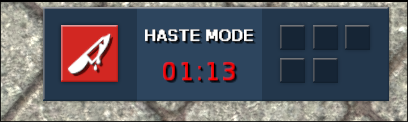
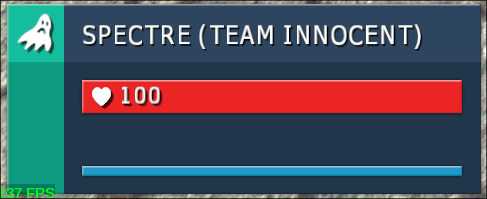
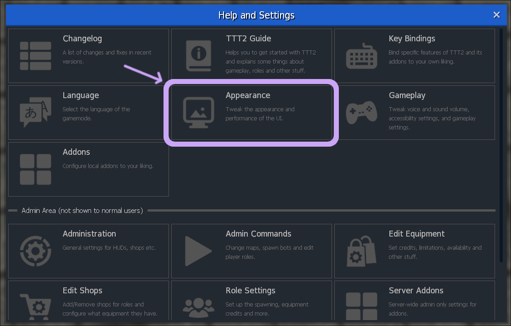
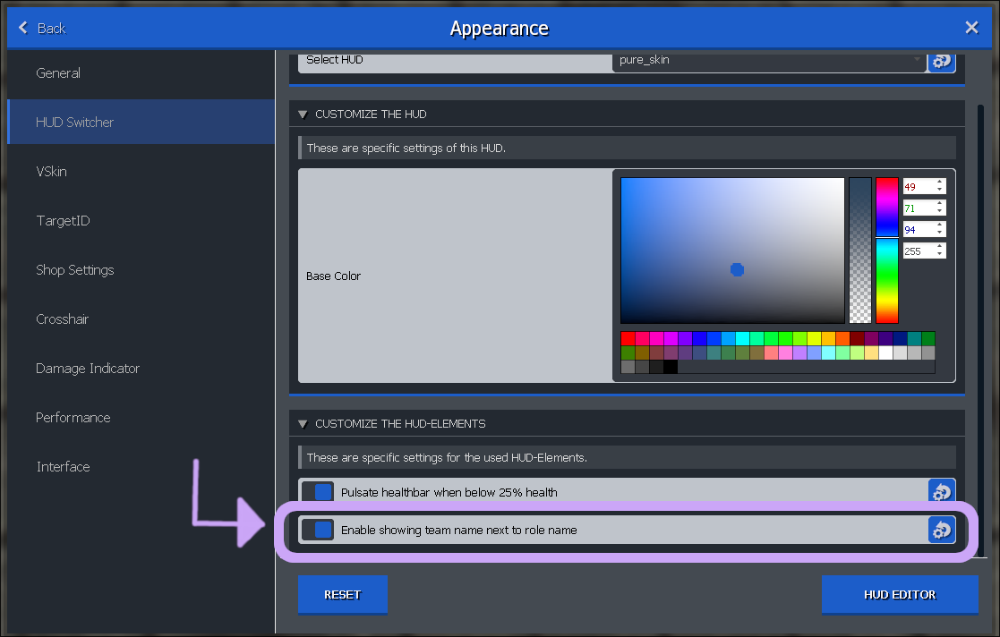

## Generelles

- Über das mittels F1 aufrufbare Menü, könnt ihr diverse TTT2 Einstellungen bearbeiten!
- Es ist möglich mit der Taste "k" etwas oder jemanden (für alle) zu pingen!
- Es ist möglich einen Mapvote zu starten in dem genügend spieler "rtv" in den Chat schreiben!

### Anzeigen von aktuellem Team

Standardmäßig wird das aktuelle Team als Symbol neben dem Timer angezeigt.

Es ist jedoch möglich, dies auch neben der aktiven Rolle als Text anzuzeigen.

#### Anleitung

Um dies zu tun müsst ihr folgendes zun
{}

### Aussehen (Appearance) Menü aufrufen

Einfach das F1 Menü aufrufen und dort auf Aussehen bzw. Appearance klicken.

### HUD Wechsel (HUD Switch) Menü aufrufen

Links in der Leiste auf HUD Wechsel bzw. HUD Switch klicken.

### Show team name aktivieren

Im HUD Wechsel Menü nach ganz unten scrollen und "Enable showing team name next to role name" aktivieren.

{}

## Discord

### Automatisches Muten

- Bei Tod werden Spieler automatisch in Discord stummgeschaltet!
- Bei Respawn, Rundenwechsel oder Mapwechsel werden Spieler automatisch wieder entmuted! (Ausnahmen Rollen wie z.B. [Shinigami]())
- Diese Funktionalität kann von entsprechenden [Minigames]() überschrieben werden!

<small>Das verantwortliche (selbstentwickelte) Addon findet ihr hier: https://github.com/Discord-for-TTT2/dttt</small>

## Rolleninteraktionen

- Der [Detective]() kann von anderen Rollen wie z.B. dem [Sidekick]() des [Jackals]() überschrieben werden. Wichtig zu beachten ist: er wird dennoch als [Detective]() für andere angezeigt!
- Wenn jemand die Rolle eines anderen übernimmt, erhält er das Standardequipment! Beispielsweise wenn ein [Unknown]() von einem [Sheriff]() erschossen wird, erhält er ebenfalls die Deputy Deagle.
